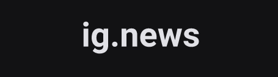

<h1 align="center">
	
</h1>


    

## About
This application is the infrastructure for a newsletter service for React.js and software development news.

This repository and all the code contained in it are part of [Rocketseat](https://rocketseat.com.br/)'s Ignite bootcamp, class 01, as a lesson on Next.js basics. 🚀

# Table of contents
- [Table of contents](#table-of-contents)
- [Status](#status)
- [Features](#features)
- [How to install and run this application](#how-to-install-and-run-this-application)
  - [Prerequisites](#prerequisites)
  - [Installing and running](#installing-and-running)
- [Techs utilized](#techs-utilized)
- [Author and Acknowledgements](#author-and-acknowledgements)
# Status
This repository is still a work in progress. More changes, features, corrections and refactorings are coming on the near future. ⌚
# Features
- [x] Responsive landing page
- [x] Static side generation functionalities

# How to install and run this application
## Prerequisites
To run this code you will need the latest versions of [Node.js](https://nodejs.org/en/) and [Yarn](https://yarnpkg.com/) installed on your machine.
## Installing and running
```bash
# Clone this respository
$ git clone <https://github.com/Gabriel-f-r-bojikian/ig.news.git>

# Move into the newly created folder
$ cd ignews

# Install all dependencies
$ yarn

# Run the application in development mode
$ yarn dev
```
# Techs utilized
The following technologies were used for the completion of this challenge:
- 
- 
- 
- 
- 
- 


# Author and Acknowledgements
The original code was done by [Rocketseat](https://rocketseat.com.br/) 🚀. All modifications in this repository were made by me, Gabriel Fernandes. 💪

My links for contact are:
[](https://github.com/Gabriel-f-r-bojikian) [](https://www.linkedin.com/in/gabriel-fernandes-rosa-bojikian-688b84164/) [](mailto:gabriel.f.r.bojikian@gmail.com)